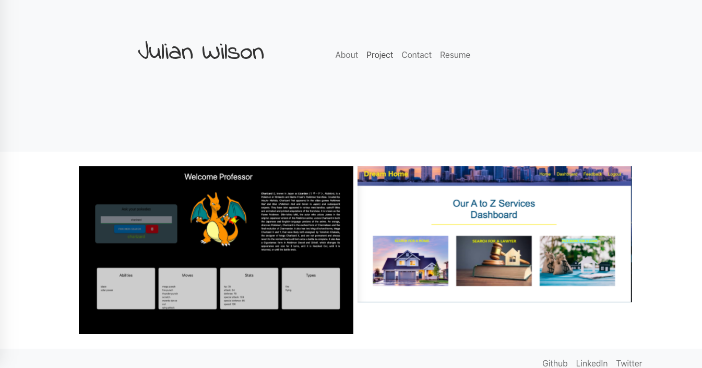
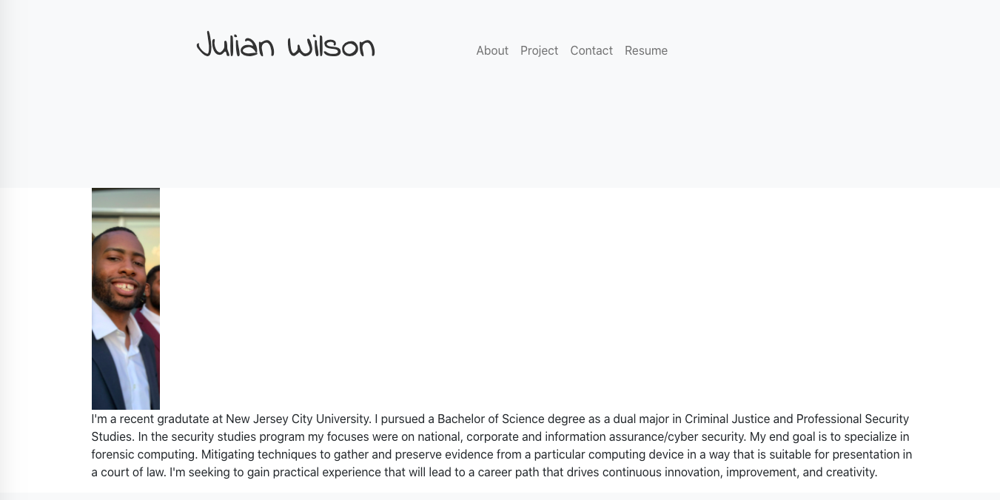

 
   

  
  

  
  # React Portfolio

  
  
   
   
  
  
  
  
  

   
  

By Julian Wilson
   
   

  

  
   
     
   

  
  

  
Table of Contents

  
  - [About](#about)
  - [Built With](#built-with)
  - [Author](#Author)
  - [Deployment URL](#DeploymentURL)
  

  
  ## 
  About 

  
  

   
  This application is a Portfolio site used with React for seamless Rendering and smooth bootstraping.

 

   
   

  

     
Screenshots

    
  
  
   
   
  
   
   
  

  
   
   
   
   
  
  
  # Built With
> - <a href="https://www.w3schools.com/css/">CSS</a>
> - <a href="https://www.w3schools.com/html/">HTML</a>
> - <a href="https://nodejs.org/en/">Node</a>
> - <a href="https://www.tutorialspoint.com/nodejs/       nodejs_express_framework.htm">Express</a>
> - <a href="https://www.w3schools.com/js/js_es6.asp">ES6</a>
> - <a href="https://www.w3schools.com/js/DEFAULT.asp">Javascript</a>
> - <a href="https://reactjs.org/">React</a> 